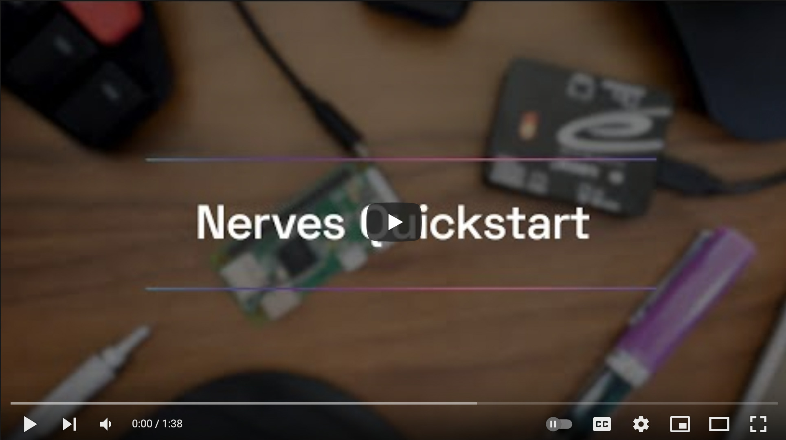
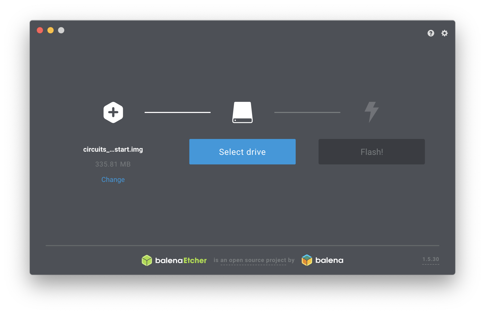
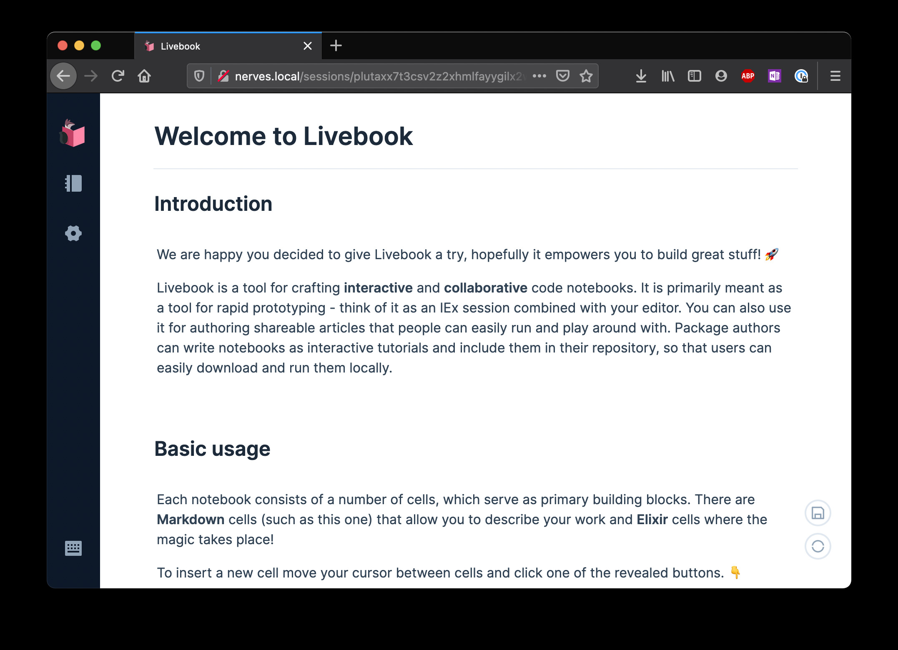

# Nerves Livebook Firmware

[](https://circleci.com/gh/livebook-dev/nerves_livebook)

The Nerves Livebook firmware lets you try out the Nerves projects on real
hardware without needing to build anything. Within minutes, you'll have a
Raspberry Pi or Beaglebone running Nerves. You'll be able to run code in
[Livebook](https://github.com/livebook-dev/livebook) and work through Nerves
tutorials from the comfort of your browser.

Looking for a quick demo first? Click below for [Underjord's](https://underjord.io/) Nerves Quickstart video.

[](https://www.youtube.com/watch?v=-b5TPb_MwQE)

## Prerequisites

First, you'll need to get some hardware. Nerves Livebook supports the following
devices:

* `bbb` - BeagleBone Black, BeagleBone Green, PocketBeagle, etc.
* `grisp2` - [GRiSP2](https://www.grisp.org/) (Experimental)
* `rpi0` - Raspberry Pi Zero or Zero W
* `rpi` - The original Raspberry Pi Model B
* `rpi2` Raspberry Pi 2 Model B
* `rpi3` - Raspberry Pi 3 Model B and Model B+
* `rpi3a` - Raspberry Pi 3 Model A+ and Raspberry Pi Zero 2 W
* `rpi4` - Raspberry Pi 4 Model B
* `osd32mp1` - Octavo OSD32MP1-BRK
* `npi_imx6ull` - Seeed Studio imx6ull (select the MicroSD boot mode switches)
* `mangopi_mq_pro` - MangoPi MQ Pro (Allwinner D1 64-bit RISC-V)

Some of these are easier than others to use. If you have a choice, the Raspberry
Pi Zero, Raspberry Pi 4 and BeagleBones are good ones to try first. These boards
have a lot of functionality and connecting them to a network is a little easier
than the others.

## Downloading the Firmware

If you're using a GRiSP 2, skip to the installation instructions below for it.

First, find the appropriate firmware or zip'd image file for your hardware in the
[releases](https://github.com/livebook-dev/nerves_livebook/releases). This is a
one time step. There's a Livebook notebook for upgrading the firmware for when
we make releases!

You have two firmware packaging options. The first is to use the
[`fwup`](https://github.com/fwup-home/fwup) commandline application and the
other is to use a program like [Etcher](https://www.balena.io/etcher/). Download
the file with the `.fw` extension for `fwup` and the `zip` file for Etcher. If
you're ok with the commandline, using `fwup` will come in handy if you start using
Nerves more.

Once the download completes, you're ready to install the firmware on your device.

## Burning the Firmware for devices that boot from MicroSD

These instructions will work for the Raspberry Pi, Beaglebones and other devices
that either boot off MicroSD cards or can be configured to do so. If you're
using a GRiSP 2, see the GRiSP 2 installation section.

Navigate to the directory where you downloaded the firmware. Either `fwup` or
`etcher` can be used to burn the firmware.

To be clear, this formats your SD card, and you will *lose all data on the SD
card*. Make sure you're OK with that.

### `fwup`

You'll need to install `fwup` if you don't have it. On Mac, run `brew install
fwup`. For Linux and Windows, see the [fwup installation
instructions](https://github.com/fwup-home/fwup#installing).

```sh
$ fwup nerves_livebook_rpi0.fw
Use 15.84 GB memory card found at /dev/rdisk2? [y/N] y
```

Depending on your OS, you'll likely be asked to authenticate this action. Go
ahead and do so.

```console
|====================================| 100% (31.81 / 31.81) MB
Success!
Elapsed time: 3.595 s
```

If you're using a WiFi-enabled device and want the WiFi credentials to be
written to the MicroSD card, initialize the MicroSD card like this instead:

```sh
sudo NERVES_WIFI_SSID='access_point' NERVES_WIFI_PASSPHRASE='passphrase' fwup nerves_livebook_rpi0.fw
```

You can still change the WiFi credentials at runtime using
`VintageNetWiFi.quick_configure/2`, but this helps if you don't have an easy way of
accessing the device to configure WiFi.

Now you have Nerves Livebook ready to run on your device. Skip ahead to the next
section.

### `etcher`

Start [`etcher`](https://www.balena.io/etcher/), point it to the zip file, and
follow the prompts:



IMPORTANT: There's no way to configure the initial WiFi credentials with
`etcher`. If you have a device that you can only access via WiFi (so no way of
setting credentials), then check out the `fwup` instructions above.

## GRiSP 2 installation

GRiSP 2 support is VERY new. While it should be safe, it's probably a good idea
to skim the
[instructions](https://github.com/grisp/grisp_demo/tree/sylane/make-image) for
re-installing the GRiSP demo app. If that doesn't look that hard, then let's
continue:

Assuming you don't already have a Nerves firmware on your GRiSP 2, you'll need
to do a first time install. Even if you do have Nerves on your GRiSP 2, you can
still follow these instructions.

First, download `nerves_livebook_grisp2.img.gz`from the latest
[releases](https://github.com/livebook-dev/nerves_livebook/releases).

1. Copy `nerves_livebook_grisp2.img.gz` to a FAT-formatted MicroSD card:

        $ cp nerves_livebook_grisp2.img.gz /Volumes/...

2. Unmount the MicroSD card and insert it into the GRiSP 2.

3. Connect the GRiSP 2 to your computer via USB via `picocom` or another
   serial terminal program. The GRiSP 2 shows up as two serial ports. Connect to
   second one. On MacOS, it's `/dev/tty.usbserial-0<GRiSP Serial Number>1`.

4. Press the reset button on the GRiSP 2. Press a key on the serial console to
   get a Barebox prompt.

5. At the Barebox prompt, run:

        :/ uncompress /mnt/mmc/nerves_livebook_grisp2.img.gz /dev/mmc1
        :/ reset

6. The GRiSP 2 will reboot into the Nerves Livebook firmware. The first boot
   takes a little longer due to it initializing the application data partition.

Once it boots, you can use the IEx prompt over the USB cable or connect over
Ethernet. There's a sticker on the back of the GRiSP with the serial number. The
device will be at `nerves-<serial number>.local` on the network.

To configure WiFi, run:

```elixir
VintageNetWiFi.quick_configure("ssid", "password")
```

`VintageNet.info` will show the current state of the network connections.

The normal Nerves firmware update methods will work. Since the GRiSP 2 port
is so new, it may be required to perform a fresh install using the above
instructions in the future.

To see the current progress of the GRiSP 2 port to Nerves, see
[nerves_system_grisp2](https://github.com/fhunleth/nerves_system_grisp2).

## Running the Firmware

Eject the SD card and insert it into the device that you're using. Power up the
device and connect a network cable. If you're using a Raspberry Pi Zero,
Beaglebone or Raspberry Pi 4, a USB cable can provide both power and network.

The first boot can take longer than subsequent boots due to initializing the
data filesystem for storing your notebooks. It is noticeable especially on large
MicroSD cards.

Most, but not all supported devices, have an LED on them. Nerves Livebook will
make it blink when the network is disconnected and change it to solid on when
it's possible to connect over any network interface.

Once the device is ready, point your browser at http://nerves.local. The password
is "nerves".



## Special Windows setup

Microsoft Windows requires a device driver to be installed to support networking
over a USB cable:

1. Download the [USB Ethernet/RNDIS Gadget driver](https://www.catalog.update.microsoft.com/Search.aspx?q=usb%5Cvid_0525%26pid_a4a2)
   from the Microsoft Update Catalog
2. Connect your Raspberry Pi or Beaglebone that's running Nerves Livebook to
   your computer
3. Start Device Manager
4. You should see a COM device show up
   1. Right click on it and update the driver
   2. Select "Let me pick", then "Have disk", and point it at the digitally
      signed inf/cat files downloaded in step 1
5. Once the COM device changes into a "USB Ethernet/RNDIS Gadget" device you'll
   be able to visit [nerves.local](http://nerves.local) in a browser

## Going further

At some point you may want to customize Nerves Livebook. See the [Nerves
Installation](https://hexdocs.pm/nerves/installation.html) and [Getting
Started](https://hexdocs.pm/nerves/getting-started.html) guides for details.

To build the Nerves Livebook firmware, make sure that you have run through the
Nerves installation steps. Then open a terminal window and run the following:

```sh
$ git clone https://github.com/livebook-dev/nerves_livebook.git
$ cd nerves_livebook

# Set the MIX_TARGET to the desired platform (rpi0, bbb, rpi3, etc.)
$ export MIX_TARGET=rpi0
$ mix deps.get
$ mix firmware

# Option 1: Insert a MicroSD card
$ mix burn

# Option 2: Upload to an existing Nerves Livebook device
$ mix firmware.gen.script
$ ./upload.sh livebook@nerves.local
```

## Firmware provisioning options

Nerves Livebook supports some device-specific customization after the firmware
has been created. This means that you don't need to rebuild the firmware to set
any of the options in this section. Instead, they are set when you use `fwup` to
initialize a MicroSD card. Here's an example invocation of `fwup` to show what
to do:

```sh
sudo NERVES_WIFI_SSID='access_point' NERVES_WIFI_PASSPHRASE='passphrase' fwup nerves_livebook_rpi0.fw
```

See the `config/provisioning.conf` for details. Here is a summary of the
options:

Environment variable | Nerves.Runtime.KV key | Description
 ------------------- | --------------------- | -----------
NERVES_SERIAL_NUMBER | nerves_serial_number  | Set the device serial number to the specified text (default is to use device-specific unique ID)
NERVES_WIFI_FORCE    | wifi_force            | Set to `true` to always set WiFi credentials on boot even if other ones were previously set
NERVES_WIFI_PASSPHRASE | wifi_passphrase     | A WiFi passphrase to use if WiFi hasn't been configured
NERVES_WIFI_SSID     | wifi_ssid             | A WiFi SSID to use if WiFi hasn't been configured

## License

Copyright (C) 2021-22 Frank Hunleth

    Licensed under the Apache License, Version 2.0 (the "License");
    you may not use this file except in compliance with the License.
    You may obtain a copy of the License at [http://www.apache.org/licenses/LICENSE-2.0](http://www.apache.org/licenses/LICENSE-2.0)

    Unless required by applicable law or agreed to in writing, software
    distributed under the License is distributed on an "AS IS" BASIS,
    WITHOUT WARRANTIES OR CONDITIONS OF ANY KIND, either express or implied.
    See the License for the specific language governing permissions and
    limitations under the License.
