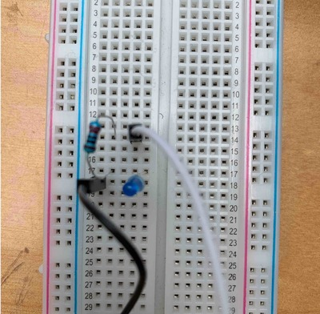
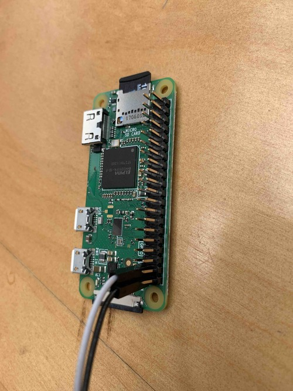
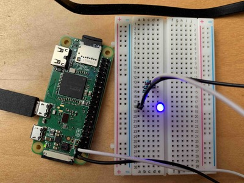

# Nerves Livebook Firmware

[](https://circleci.com/gh/elixir-circuits/nerves_livebook)

The Nerves Livebook firmware lets you try out the Nerves projects on real
hardware without needing to create a Nerves project, install Elixir on Raspbian
on a Raspberry Pi or compiling any Elixir code at all.  Within minutes, you'll
have a device running Nerves. You'll be able to explore the Nerves environment
with [toolshed](https://hexdocs.pm/toolshed/readme.html), and you'll be able to
blink LEDs from the device itself. You'll also be able to explore the other
Nerves libraries and experiment with
[I2C](https://hex.pm/packages/circuits_i2c),
[SPI](https://hex.pm/packages/circuits_spi),
[GPIOs](https://hex.pm/packages/circuits_gpio), and
[UARTs](https://hex.pm/packages/circuits_uart).

## Prerequisites

To work through this tutorial, you'll need any Raspberry Pi or BeagleBone
device. The Circuits Quickstart firmware configures Raspberry Pi Zero, Zero W, 3
Model A+, and any BeagleBone-compatible device in what's called gadget mode. In
gadget mode, the device uses a USB cable for power, serial console, and
networking. We recommend using these devices if they're available. The other
devices require a HDMI monitor and keyboard or a wired Ethernet connection.

For this tutorial, you'll also need the following:

* 1 MicroSD card
* [fwup](https://github.com/fhunleth/fwup) or [etcher](https://www.balena.io/etcher/) for burning firmware to the MicroSD card
* 1 LED
* 1 100-500 Ohm resistor
* 1 breadboard
* 2 male-to-female jumper cables

## Downloading the Firmware

Find the appropriate firmware or zip file
[here](https://github.com/elixir-circuits/nerves_livebook/releases). If
you're using `fwup` to write images to MicroSD cards, download the `.fw`
extension and if you're using `etcher`, get the `zip` file. Releases are named
by the boards they support:

* `bbb` - BeagleBone Black, BeagleBone Green, PocketBeagle, etc.
* `rpi0` - Raspberry Pi Zero or Zero W
* `rpi` - The original Raspberry Pi Model B
* `rpi2` Raspberry Pi 2 Model B
* `rpi3` - Raspberry Pi 3 Model B and Model B+
* `rpi3a` - Raspberry Pi 3 Model A+
* `rpi4` - Raspberry Pi 4 Model B
* `osd32mp1` - Octavo OSD32MP1-BRK
* `npi_imx6ull` - Seeed Studio imx6ull (select MicroSD boot mode)

Once that's done, you're ready to burn the firmware to the MicroSD card.

## Burning the Firmware

Navigate to the directory where you downloaded the firmware. We'll go through
both `fwup` and `etcher` methods.

To be clear, this formats your SD card, and you will *lose all data on the SD
card*. Make sure you're OK with that.

### `fwup`

```console
λ ~/fwup nerves_livebook_rpi0.fw
Use 15.84 GB memory card found at /dev/rdisk2? [y/N] y
```

Depending on your OS, you'll likely be asked to authenticate this action. Go
ahead and do so.

```console
|====================================| 100% (31.81 / 31.81) MB
Success!
Elapsed time: 3.595 s
```

It's quite fast. Now you have Nerves ready to run on your device.  Skip ahead to
the next section.

### `etcher`

Start `etcher`, point it to the zip file, and follow the prompts:


## Testing the Firmware

Eject the SD card and insert it into the device that you're using. Power up and
connect the device with a USB cable. In the case of the `rpi0`, the micro USB
does both.

Once the device boots, you can now connect to it. There are three ways to
connect to the device: `ssh`, `picocom`, and distributed Erlang. We'll take a
look at `ssh`.

### `ssh`

The `nerves_livebook` project configures the user as `circuits` with the
host `nerves.local` and has the password set as `circuits`. With that in mind,
we can use the `ssh` command to get to the `iex` prompt.

```console
λ ~/ ssh circuits@nerves.local
Warning: Permanently added 'nerves.local,172.31.112.97' (RSA) to the list of known hosts.
Nerves Livebook
https://github.com/elixir-circuits/nerves_livebook

ssh circuits@nerves.local # Use password "circuits"

Password:
Interactive Elixir (1.11.2) - press Ctrl+C to exit (type h() ENTER for help)
Toolshed imported. Run h(Toolshed) for more info.

                ;kX'
              ,0XXXl
             xNXNNXX.
           'KNNXXXXX0.
          ;XNNNNNNNNN0.
         ;XNNNNNNNNNNNX:
        .XNNNXXXXXXXXXXXO.
        kNNNXNNNNXXNXXNNXNo
       .NNNXNNNNNXXNNXNNXXXO
       cXXXNNNNNNXXNNNNNNNNNd
       lNNNNNNNNNXXNXXXNNNNNK
       'NNXNXNXXXXXXXXXNNNNNk
        oNXNXXXXXNXXXNNNNXXX.
         :KXXXXXXNXXXNNNNXk.
           ;xXNXXXXNXXX0o.
              .',::;,.

      Nerves Livebook

All of the Nerves projects are available in this firmware
image. See https://github.com/elixir-circuits/nerves_livebook for
more details.

View log messages with `RingLogger.next` or `RingLogger.attach`. Toolshed
helpers are available. Type `h Toolshed` for details.

If connecting via ssh, type `exit` or `<enter>~.` to disconnect.

iex(nerves_livebook@nerves.local)1>
```

In a matter of minutes, you have Nerves running on a device. As the text
suggests, let's play around with `Toolshed` to see what's going on.  Run `h
Toolshed` to see some of the helpers you can use. Let's take a look at a couple.
`top` lists you the top processes in your system which can help in debugging and
general system observability.

```elixir
iex(nerves_livebook@nerves.local)3> top
Total processes: 165

Application  Name or PID                   Reds/Δ      Mbox/Δ     Total/Δ      Heap/Δ     Stack/Δ
undefined    erl_prim_loader               175K/175K      0/0       84K/84K     10K/10K       5/5
undefined    application_controller        153K/153K      0/0       73K/73K     28K/28K       7/7
undefined    <0.1048.0>=Elixir.IEx.Evalua   95K/95K       0/0       25K/25K    6772/6772    383/383
kernel       code_server                    88K/88K       0/0      220K/220K    28K/28K       3/3
ssh          <0.1043.0>=ssh_connection_ha   77K/77K       0/0       13K/13K    2586/2586     12/12
nerves_runti Elixir.Nerves.Runtime.KV       66K/66K       0/0       73K/73K     28K/28K      10/10
nerves_netwo Nerves.Network.Interface.usb   48K/48K       0/0       14K/14K    4185/4185     10/10
mdns         Elixir.Mdns.Server             38K/38K       0/0       17K/17K    6772/6772     10/10
system_regis Elixir.SystemRegistry.Proces   27K/27K       0/0      9358/9358   2586/2586     10/10
ssh          <0.1044.0>=ssh_client_channe   21K/21K       0/0       13K/13K    6772/6772     10/10
```

There are Linux system commands like `ls` as well.

```elixir
iex(nerves_livebook@nerves.local)4> ls
lib          releases
```

Finally, since this is `iex` you can write Elixir code.

```elixir
iex(nerves_livebook@nerves.local)5> defmodule A do
...(nerves_livebook@nerves.local)5> def b, do: :hello
...(nerves_livebook@nerves.local)5> end
{:module, A,
 <<70, 79, 82, 49, 0, 0, 3, 244, 66, 69, 65, 77, 65, 116, 85, 56, 0, 0, 0, 123,
   0, 0, 0, 14, 8, 69, 108, 105, 120, 105, 114, 46, 65, 8, 95, 95, 105, 110,
   102, 111, 95, 95, 7, 99, 111, 109, 112, ...>>, {:b, 0}}
iex(nerves_livebook@nerves.local)6> A.b
:hello
```

Now we're going to take a slight detour and introduce the breadboard — first
exit from `iex` with `exit` and return. Then, disconnect the RPI from the power
source.

## Breadboard

At this point, we have Nerves running on a supported device, but there's no way
to manipulate any LEDs because we currently have none connected. To connect an
LED, we'll use a breadboard. If you're not sure or have never used a breadboard,
SparkFun has a detailed
[introduction](https://learn.sparkfun.com/tutorials/how-to-use-a-breadboard/all)
(Sparkfun, by the way, is an excellent resource for electronics basics and
components).

We'll give a high-level overview of what a breadboard is and how to use it here,
too. Breadboards are useful for prototyping or creating temporary circuits; you
can adjust connections and parts as needed without soldering. Soldering isn't
difficult and it's useful when you're ready to make more permanent versions of
your circuits.

The linked SparkFun article explains in detail how breadboards work, so for our
purposes, we'll walk through creating a simple circuit to power an LED.

Insert the LED somewhere on the breadboard. Note that the longer leg of the LED
is the positive side, and the shorter side is the negative side. Then take the
resistor and bend the legs down as shown in the image. Insert one leg of the
resistor in the same row as the positive side of the LED and the other leg in an
unused row.

The resistor impedes the electrical current so that it doesn't overload the LED.

Insert one of the jumper wires in the same row as the resistor and the other in
the row with the negative leg of the LED. The result should look like the
following image.



We're finished with the breadboard. You've almost created your first circuit.
Let's close the circuit by attaching the jumper wires to the GPIO header pins on
the device.

### Pinout.xyz

But which GPIO do you use? [Pinout.xyz](https://pinout.xyz/) holds the answer. Pinout
lays out the GPIO for the Raspberry Pi. We need only two things: Broadcom pin
number (BCM) and ground. The BCM is what controls the LED's status - on or off -
and the ground grounds the circuit. You can see in the following diagram that
the ground pins are colored black and the BCM pins we're interested in are
colored green. There are other pins for power, UART, etc. and even BCM pins that
serve specific functions; for now, know they exist but ignore them.


In the image, the last two pins on the bottom row on the right are what we need
(you can choose another combination if you wish). Put the jumper wire that's
attached on the negative end of the LED to the ground pin on the device. Next,
connect the other jumper wire---the one connected to the positive leg of the LED---to BCM 26.
The following image should help orient you.



## Flashing Lights

Now that we have everything wired up, let's try turning the light off and on.
The first thing we'll do is `alias` `Circuits.GPIO` for convenience. If you're
not familiar with `alias`, see the
[guides](https://elixir-lang.org/getting-started/alias-require-and-import.html#alias).

```elixir
iex(nerves_livebook@nerves.local)8> alias Circuits.GPIO
Circuits.GPIO
```

Next, we'll open `GPIO` `26`. That's the one we put the jumper wire that leads
to the positive leg of the LED.

```elixir
iex(nerves_livebook@nerves.local)9> GPIO.open(26, :output)
{:ok, #Reference<0.1415452060.268566532.135024>}
```

Since that returned as expected, we can now pattern match to the `ref` and
assign it to `led`. `v()` runs the last command again.

```elixir
iex(nerves_livebook@nerves.local)10>  {:ok, led} = v()
{:ok, #Reference<0.1415452060.268566532.135024>}
```

Now we're ready to blink the light. Using `write/2`, we give the function the
`ref` for the LED and `1` which turns the light on.

```elixir
iex(nerves_livebook@nerves.local)11> GPIO.write(led, 1)
: OK
```

Now you should see the light illuminated.



To turn it off, use `write/2` again and pass in the same `ref` but this time
with `0` to turn the light off.

```elixir
iex(nerves_livebook@nerves.local)12> GPIO.write(led, 0)
:ok
```

That's about it. You've accomplished a great deal in not a lot of time.

## Going further

The Quickstart firmware contains all of the Nerves projects. By
connecting other hardware to your devices, you can explore more hardware
interfaces and how they're supported in Elixir. Click on the following links for
more information:

* [GPIO](https://hex.pm/packages/circuits_gpio)
* [I2C](https://hex.pm/packages/circuits_i2c)
* [SPI](https://hex.pm/packages/circuits_spi)
* [UART](https://hex.pm/packages/circuits_uart)

At some point you'll want to create your own firmware. See the [Nerves
Installation](https://hexdocs.pm/nerves/installation.html) and [Getting
Started](https://hexdocs.pm/nerves/getting-started.html) guides for details.

To build the Nerves Livebook firmware, make sure that you have run
through the Nerves installation steps. Then open a terminal window and run the
following:

```console
$ git clone https://github.com/elixir-circuits/nerves_livebook.git
$ cd nerves_livebook

# Set the MIX_TARGET to the desired platform (rpi0, bbb, rpi3, etc.)
$ export MIX_TARGET=rpi0
$ mix deps.get
$ mix firmware

# Insert a MicroSD card
$ mix burn
```
